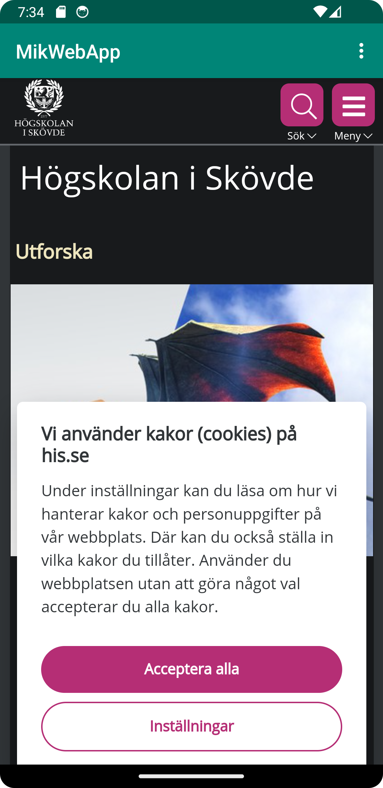
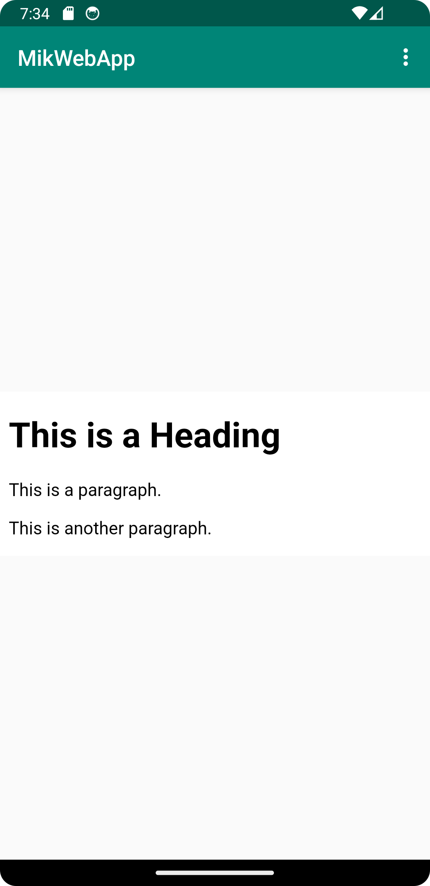

# Rapport

Först öppnades res/values/strings.xml och stringen WebViewApp ändrades till MikWebApp.
Sedan lades `<uses-permission android:name="android.permission.INTERNET" />` till i AndroidManifest.xml för att tillåta internet till appen.
Elementet TextView i activity_main.xml ändrades därefter till en WebView.
Sedan gavs WebView:en ett id med `android:id="@+id/my_webview`.
`private WebView myWebView;` laddes till i MainActivity.java och `myWebView = findViewById(R.id.my_webview);` i metoden onCreate så att java-filen kan manipulera xml-elementet.
`myWebView.setWebViewClient(new WebViewClient());` laddes också till i java-filen.
Javascript sattes sedan på med `myWebView.getSettings().setJavaScriptEnabled(true);`
Därefter skapades en assets folder och sedan en index.html-fil som kopierar html-skelettet i https://www.w3schools.com/w3css/w3css_web_html.asp
För att visa hemsidorna lades `myWebView.loadUrl("https://his.se");` till i metoden showExternalWebPage() och `myWebView.loadUrl("file:///android_asset/index.html");` i metoden showInternalWebPage().
Till sist lades metoderna i den färdiga metoden onOptionsItemSelected så att websidorna kallas när dropdown-menyerna klickas. 

# External Web Page

# Internal Web Page

